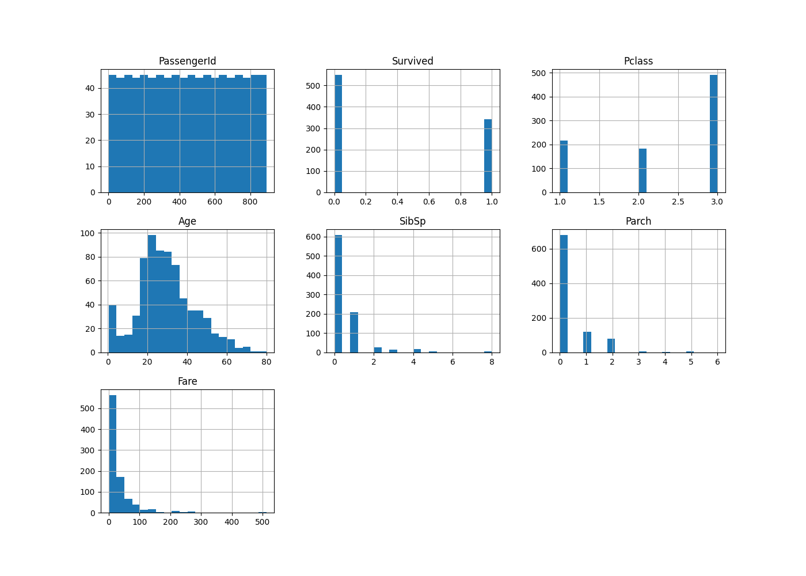
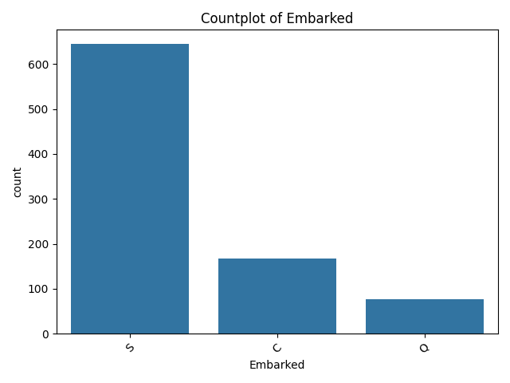
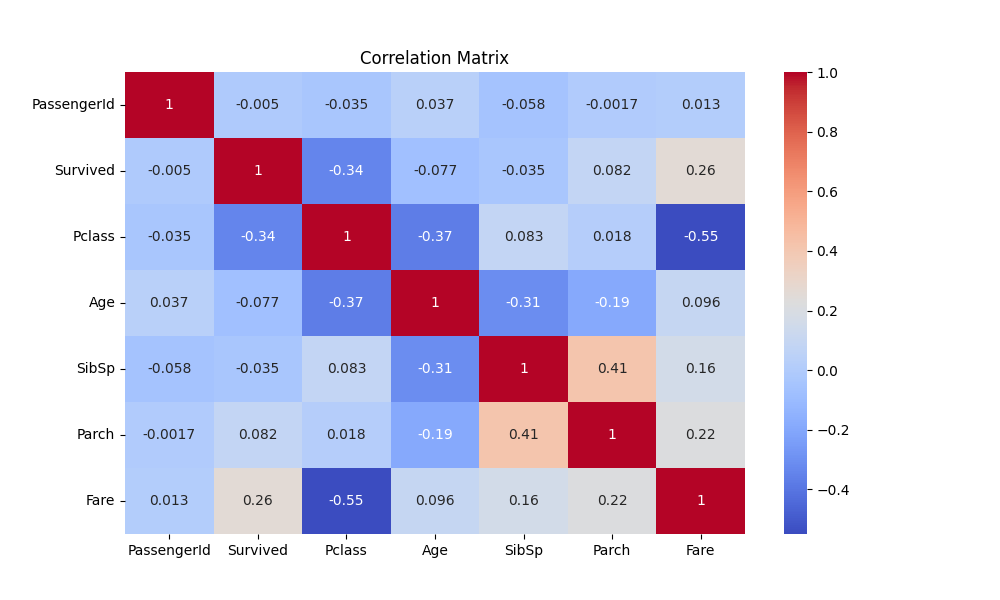
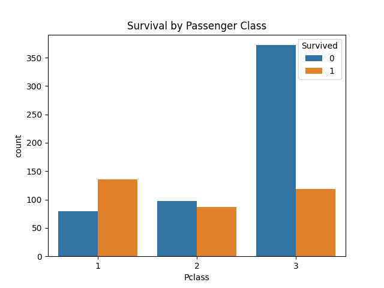
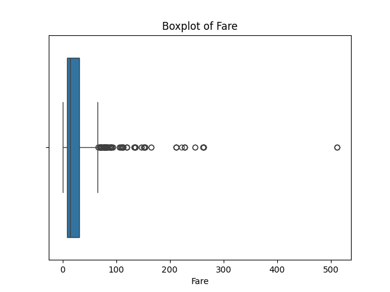

# Titanic EDA Project

This project performs exploratory data analysis (EDA) on the Titanic dataset.

## Files Included

- `eda_analysis.py` – Python script with EDA code.
- `titanic.csv` – Titanic dataset used for the analysis.
- `eda_report.md` – Summary of insights from EDA.
- `README.md` – Project overview and documentation.

## Key Features Analyzed

- Survival rates by gender and class
- Distribution and outliers in `Age` and `Fare`
- Missing value handling and data visualization
# Titanic EDA Report

## 🔍 spot_distributions_outliers

## 📊 categorical_features

## 📦 Correlation_Matrix

## 📦 Survival_by_Sex

## 📊 Survival_by_Passenger_Class

## 🔍 boxplot_to_detect_outliers

